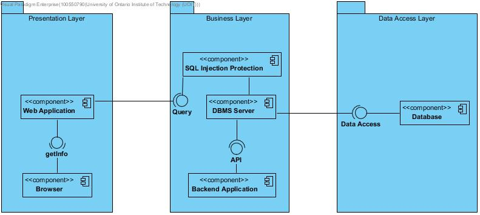

## Iteration 3: Support Quality Attribute Scenarios and Additional Concerns

#### Step 1 would normally be review of inputs, but that's already been done, thus it has been removed for simplicity.  

###### Step 1: Establish Iteration Goal by Selecting Drivers  
###### Use Cases
* UC-8  
* UC-10  
###### Quality Attributes
* QA-8  
* QA-10  
###### Constraints
* CON-7  

###### Step 2: Choose One or More Elements of the System to Refine   
The goal for this stage is to refine the security and furthering the usability of the system for particular file typing. This should be done by adding implementation of BOZ files on the backend, as well as furthering the security of the front-end login system through SQL injection defense.  
###### Step 3: Choose One or More Design Concepts that Satisfy the Selected Drivers  
Speicfic design decisions that should be used to satisfy these would be furthering the authentication of the system, to allow for the increased security and protection from SQL injection type attacks.  
Secondly, the file upload type system needs to be adddressed in order to encorporate the use of BOZ type files.  
###### Step 4: Instantiate Architectural Elements, Allocate Responsibilities and Define Interfaces  
Implement SQL protection in the query sector of the backend allowing checking for SQL injection type attacks in order to prevent such attacks from occuring.
###### Step 5: Sketch Views and Record Design Decisions  

###### Step 6: Perform Analysis of Current Design and Review Iteration Goal and Design Objectives 
Addressed through the use of the Kanban board as per project instructions.  
